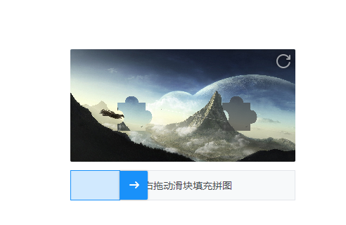

# krypton

### 介绍
验证码项目

### 使用说明

#### 滑动验证码



```html
<!-- 导入相关js和css -->
<link rel="stylesheet" href="/lib/krypton.css" media="all">
<script src="/sliding/krypton.js"></script>

<!-- 设置验证码容器 -->
<div id="kaptcha"></div>

<script type="text/javascript">
  // 绑定验证码容器
  var krypton = new Krypton('kaptcha');
  
  // 提交
  function submit() {
    // 表单参数以及校验 略
    var params = {};
    
    // 验证码校验
    var val = krypton.validateVal()
    if (!val.success) {
      // 需要先通过验证码
      return;
    }
    // 添加验证码校验参数, 后端进行校验
    params.token = val.token;
    params.validate = val.validate;
    
    // submit 略
  }
</script>
```


